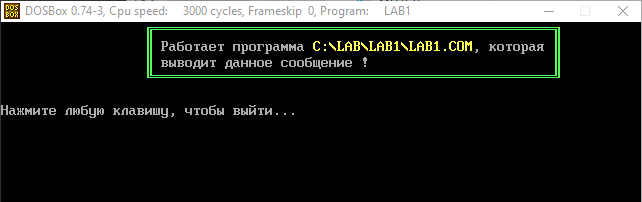

# The Frame
### Description
"The Frame" is a tiny DOS program which wrote on TASM (Turbo Assembler).
> Language: Russian | Cyrillic (CP 866)
____
### Screenshots
#### Task

#### Example 1

#### Example 2

