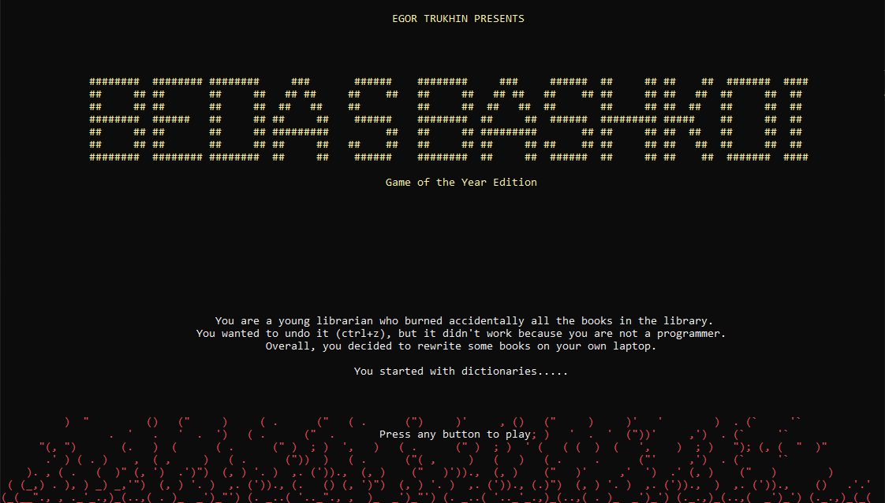
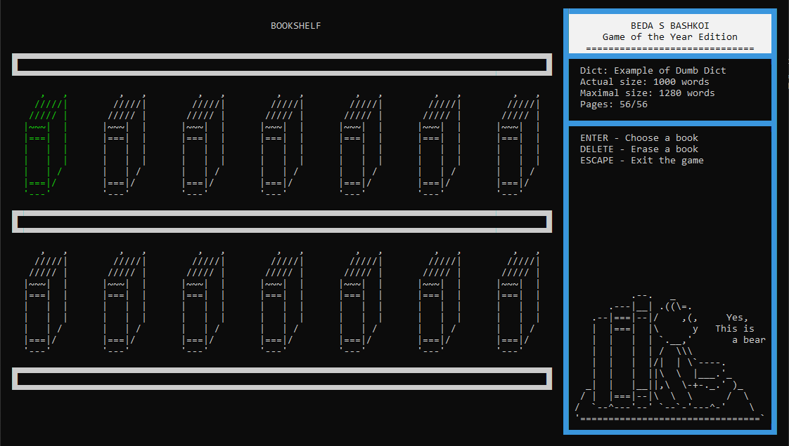
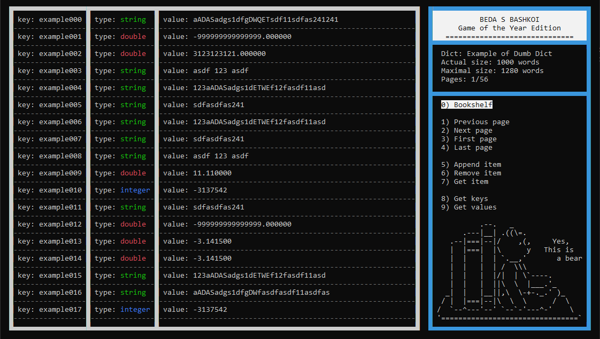

# Beda s Bashkoi
"Beda s Bashkoi" (eng. Problems with the Head) is a console mini-game which wrote for Windows using Windows API (windows.h).
This game emulates a work with dictionaries. Fantastic UI/UX design and animation are provided.
## Screenshots
#### Intro

#### Main menu / Bookshelf

#### Dictionary

