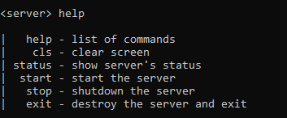
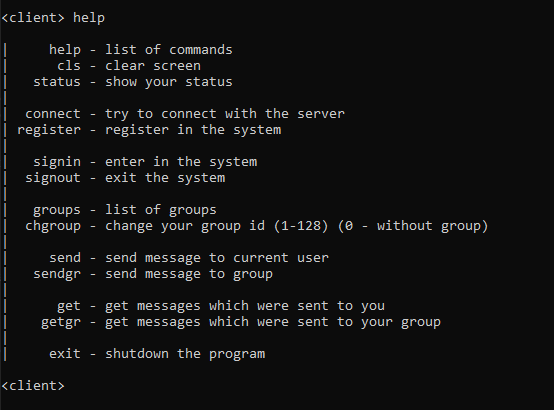

# C-Task "NanoChat" | 15.05.2020

### Задача
```
Необходимо разработать чат для общения двух и более пользователей (попарно и в группах).  
Необходимо иметь сервер, на котором хранятся все контакты, логины/пароли, списки каждого контакта, история сообщений, новые сообщения

Клиент подключается к серверу, указывает логин/пароль, получает все сообщения, которые ему прислали его контакты, может отправить новые сообщения,
если контакт не в сети - сообщение будет храниться на сервере, когда контакт станет доступен, пользователь получит уведомление

Одновременно к серверу может подключиться больше одного клиента.  
Максимальное ограничение устанавливаете сами (не менее 10 одновременных подключений)

```

### Как начать
#### Сервер
Исходный код серверной составляющей всего приложения "NanoChat" расположен по пути src/server/. В этом же каталоге сожержиться папка 'data/' содержащая три текстовых файла.
- **log.txt** содержит в себе все входные данные, поступающие на сервер, на протяжении его жизни.
- **database.txt** содержит строки из пар: логин|пароль
- **messages.txt** содержит строки из пар: получатель|данные. Получателем может выступать как уникальный пользователь, так и номер группы.   

Групповой обмен сообщения реализован через каналы, на которые поступаю все сообщения от пользователей, которые его выбрали. После запуска приложения "server", необходимо запустить (проинициализоровать) сам сервер. Для этого есть команда `start`, после её выполнения, к серверу смогут подключаться клиенты. Для того чтобы посмотреть информацию о видимых в данный момент клиентах нужно использовать команду `status`.  
Показать все команды - `help`.  



#### Клиент
Исходный код клиентской составляющей всего приложения "NanoChat" расположен по пути src/client/. При запуске приложения "client", есть вероятность того, что сам клиент был запущен раньше, чем сервер. Чтобы вручную подключиться к серверу необходимо использовать команду `connect`. Следющим шагом станет регистрация командой `register` и вход в систему командой `signin`. Чтобы отправить сообщение конкретному получателю используете команду `send`. Если вы хотите присоедениться к каналу (от 1 до 128), используете команду `chgroup`. Чтобы отправить сообщение в канал используете команду `sendgr`.  
Узнать больше об остальных командах - `help`.  


