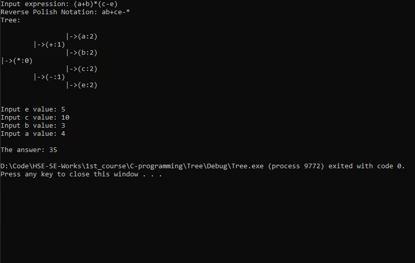
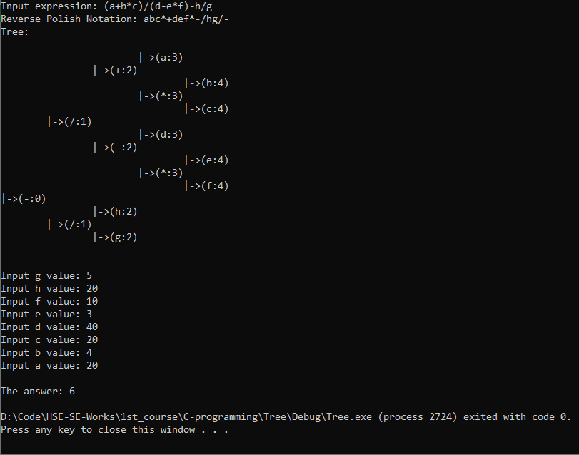

# C-Task #3 "Binary Tree" | 10.04.2020

### Задача
```
Построить бинарное дерево по введенному арифметическому выражению.  
- Рассчитать значение выражения по дереву.  
- Выражение может содержать скобки, знаки +, -, *, /.  
- Выражение содержит переменные. Значения переменных вводятся после самого выражения.  
- Гарантируется правильность выражения
```
### Решение
#### Лёгкий пример


#### Сложный пример

