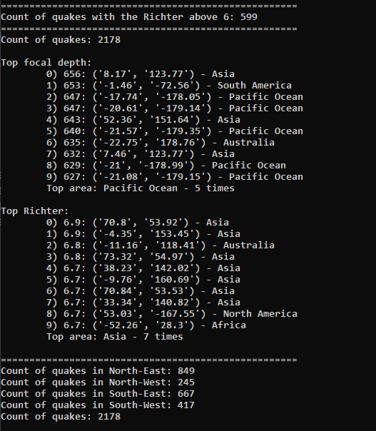

Домашняя работа от 17.11.2020

**Задание 1** 
1. Прочитать файл  quake.csv

2. Посчитать количество землетрясений силой больше 6 баллов 

3. Найти координаты топ-10 самых глубоких землетрясений, топ-10 самых сильных землетрясений, если все точки (или большинство) принадлежат какому-то одному региону – сказать, что это за регион 

4. Посчитать количество землетрясений в восточном, западном, северном и южном полушарии, найти топ-10 по глубине и силе в каждом полушарии. Какое полушарие имеет самые сильные/глубокие землетрясения? 

5. Найти землетрясение, самое удалённое от всех других землетрясений. 

**Задание 2** 

1. Прочитать файл Air Quality(значение -200 является пропущенным значением, не использовать его в заданиях при поисках минимумов/максимумов)

2. Написать функцию, определяющую день и час, когда была наибольшая и наименьшая концентрация веществ в любом признаке (название признака, определение «наибольший» или «наименьший», задаются аргументом функции) 

3. Написать функцию, определяющую день, когда в среднем была наибольшая и наименьшая концентрация веществ. 

4. Пусть локальный минимум или локальный максимум – это некоторый момент во времени такой, что в предыдущие 3 часа концентрация веществ снижалась, а в последующие 3 часа повышалась (или наоборот). Посчитать, в какое время дня чаще всего происходят локальные максимумы/минимумы, проверить ответ для разных столбцов. 

