# Веб-сервер с доступом к файловой системе

## ___Задача___
Необходимо установить, настроить и запустить файловый сервер Samba с доступ через веб-интерфейс Apache.

## ___Подготовка___
Настройка и проверка веб-сервера проводилась в локальной сети:
- Машина на Linux: Debian (хост: 192.168.1.100)
- Машина на Windows 10 (пользователь: 192.168.1.101)

Обновление системы:<br>
`sudo apt update -y && sudo apt full-upgrade -y`

Установка веб-сервера Apache и сетевой службы Samba:<br>
`sudo apt install apache2 samba -y`

## ___Проверка установки___
Запустим службу, отвечающую за работу веб-сервера:<br>
`sudo service apache2 start`

В поисковой строке веб-браузера введём:<br>
`http://localhost`

___Если всё сделано правильно, мы увидим стандартную страницу:___<br>
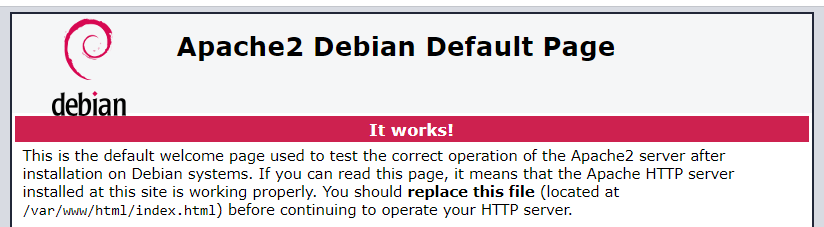

## ___Настройка хоста___
### ___Apache___
Создадим рабочую директорию нашего сервера:<br>
`sudo mkdir /server`

Создадим новый файл конфигурации для подключения:<br>
`sudo touch /etc/apache2/sites-available/server.conf`

Заполним его этими данными:<br>
```html
<VirtualHost *:80>

	ServerAdmin webmaster@localhost
	DocumentRoot /server

	<Directory /server>
		Require all granted
		Options Indexes
		AllowOverride None
	</Directory>

</VirtualHost>
```

Отключим стандартный сайт и подключим новый:<br>
`sudo a2dissite 000-default.conf`<br>
`sudo a2ensite server.conf`

Запустим службу Apache:<br>
`sudo service apache2 start`

___Проверим работу:___<br>
В поисковой строке веб-браузера введём: `http://localhost` <br>
Мы увидим страницу, отображающую пустую директорию:<br>
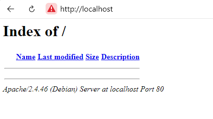

### ___Samba___
Создадим гостевую директорию, доступную всем:<br>
`sudo mkdir /server/guest`<br>
`sudo chown -R nobody:nogroup /server/guest/`<br>
`sudo chmod -R 777 /server/guest/`

Откроем конфигурационный файл Samba:<br>
`vi /etc/samba/smb.conf`

В самый конец добавим описание гостевой директории:<br>
```
[guest]
	path = /server/guest
	force user = nobody
	browsable = yes
	writeable = yes
	guest ok = yes
```

Запустим службу Samba:<br>
`sudo service smbd start`

___На веб-странице появиться пустая папка:___<br>
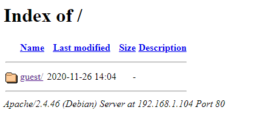

## ___Использование___

___Для подключения к гостевой папке используем проводник Windows.___<br>
В адресную строку введём следующую строку: `\\192.168.1.100\guest`<br>
- 192.168.1.100 - адрес сервера(хоста)
- guest - имя директории, к которой мы хотим подключиться

___Перед нами появиться пустая директория:___<br>
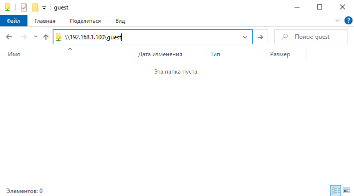

___Создадим пустой файл и новую поддиректорию:___<br>
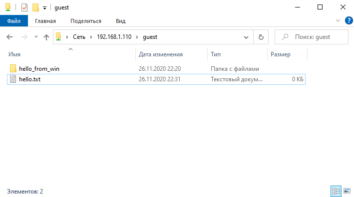

___На нашей веб-странице и в файловой системе Linux также отображаются новые файлы:___<br>
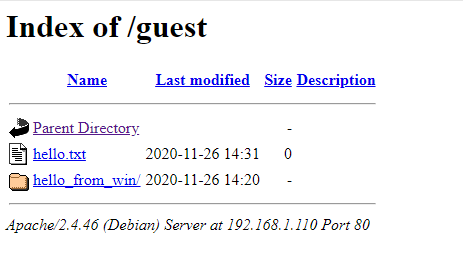
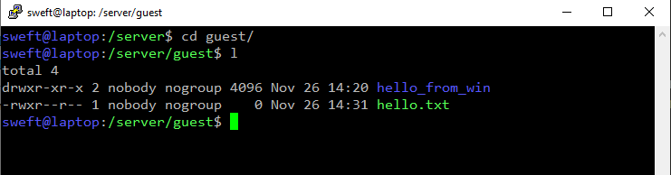

## ___Дополнительное задание №1: "Backups"___
В корне сервера создадим пустой файл размером 100MiB:<br>
`cd /server`<br>
`sudo dd if=/dev/zero of=iso count=102400 bs=1024`<br>
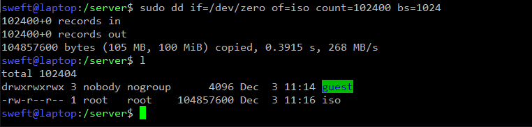

Сделаем из него образ файловой системы:<br>
`sudo mkfs.ext4 iso`<br>
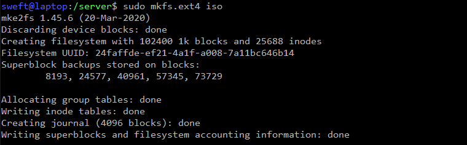

Создадим в гостевой папке точку монтирования и примонтируем новый образ:<br>
`cd /server/guest`<br>
`mkdir iso_dir`<br>
`sudo mount -o loop /server/iso iso_dir/`<br>

Проверим точку монтирования:<br>
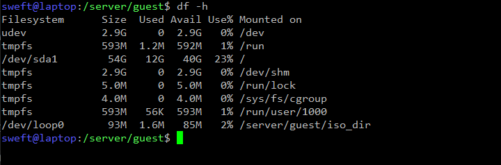

Сменим владельца:<br>
`sudo chown -R nobody:nogroup /server/guest/iso_dir`

Добавим создание бекапа нашего образа, используя cron:<br>
`sudo mkdir /server/backups`<br>
`sudo crontab -e`

В конец файла конфигурации cron добавим следующее:<br>
- Бекап в новый год<br>
`0 0 1 1 * dd if=/server/iso of="/server/backups/$(date)" count=102400 bs=1024 `
- Бекап в пятницу 13го<br>
`0 0 13 * 5 dd if=/server/iso of="/server/backups/$(date)" count=102400 bs=1024 `
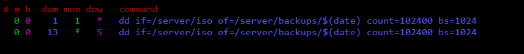

## ___Дополнительное задание №2: "Docker"___
Установка: [docs.docker.com/engine/install](https://docs.docker.com/engine/install/)

Отключим службу Apache c прошлых шагов:<br>
`sudo service apache2 stop`

Включим службу docker:<br>
`sudo service docker start`

Добавим нового пользователя `docker` для работы с docker:<br>
`sudo groupadd docker`<br>
`sudo usermod -aG docker $USER`<br>
`newgrp docker`<br>

Проверка установки:<br>
`docker run hello-world`<br>
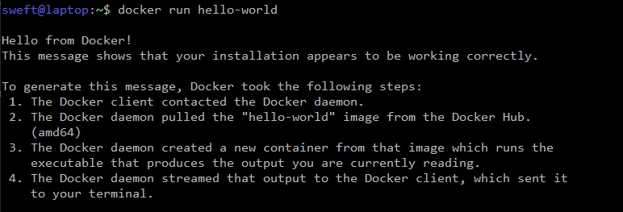

#### ___Apache___

Создадим рабочую директорию контейнера для Apache:<br>
`cd ~; mkdir docker; cd docker; mkdir apache; cd apache`

Скопируем в нашу директорию конфигурацию Apache, созданную выше:<br>
`cp /etc/apache2/sites-available/server.conf ./`<br>

Создадим конфигуратор образа:<br>
`touch Dockerfile`

И добавим в него следующее:<br>
```
FROM ubuntu:latest

# Timezone
ENV TZ=Europe/Kiev
RUN ln -snf /usr/share/zoneinfo/$TZ /etc/localtime && echo $TZ > /etc/timezone

# Install and configure Apache
RUN apt -y update
RUN apt -y install apache2
COPY ./server.conf /etc/apache2/sites-available/server.conf
RUN a2dissite 000-default.conf
RUN a2ensite server.conf

# Run
ENTRYPOINT apache2ctl -D FOREGROUND

```

Создадим образ контейнера с именем `my_apache`:<br>
`docker build . -t my_apache`

Запуск контейнера:<br>
`docker run -v /server:/server -p 8080:80 -d my_apache`

Проверим, что контейнер продолжает работу в фоновом режиме:<br>
`docker ps`<br>
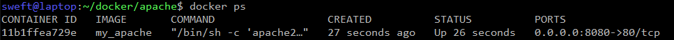

Попробуем зайти на наш сайт:<br>
`http://192.168.1.100:8080`<br>
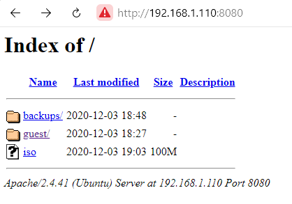

#### ___Samba___

Создадим рабочую директорию контейнера для Apache:<br>
`cd ~/docker; mkdir samba; cd samba`

Скопируем в нашу директорию конфигурацию Samba, которую мы настраивали выше:<br>
`cp /etc/samba/smb.conf ./`<br>

Создадим конфигуратор образа:<br>
`touch Dockerfile`

И добавим в него следующее:<br>
```
FROM ubuntu:latest

# Timezone
ENV TZ=Europe/Kiev
RUN ln -snf /usr/share/zoneinfo/$TZ /etc/localtime && echo $TZ > /etc/timezone

# Install and configure Samba
RUN apt -y update
RUN apt -y install samba
COPY ./smb.conf /etc/samba/smb.conf
RUN echo "service smbd start; while true; do sleep 0; done;" > run.sh
RUN chmod 777 run.sh

# Ports
EXPOSE 137
EXPOSE 445

# Run
ENTRYPOINT ./run.sh

```

Создадим образ контейнера с именем `my_samba`:<br>
`docker build . -t my_samba`

Запуск контейнера:<br>
`docker run -v /server:/server -P -d my_samba`

Проверим, что контейнер продолжает работу в фоновом режиме:<br>
`docker ps`<br>
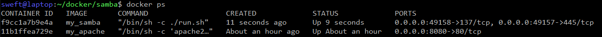
