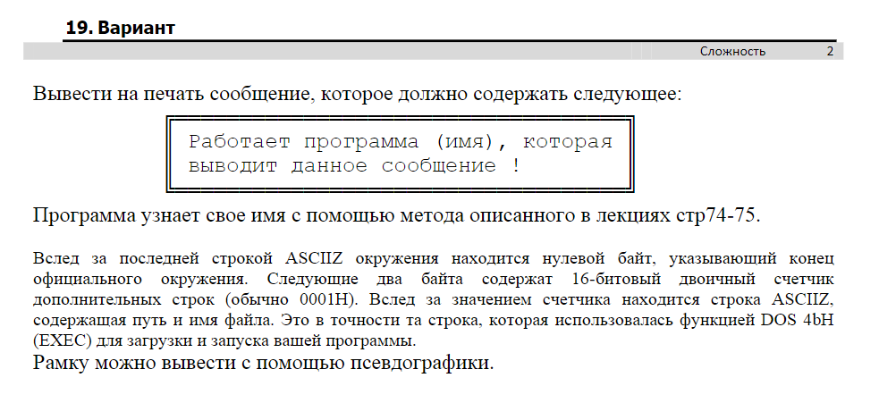
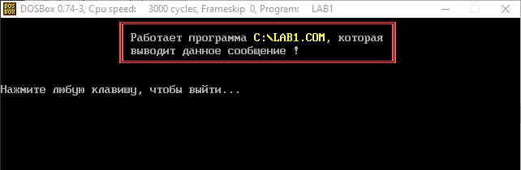
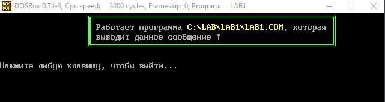

# The Frame
"The Frame" is a tiny DOS program which wrote on TASM (Turbo Assembler).  
This program prints a frame and displays source name in it using a videobuffer and line-drawing characters.  
> Language: Russian | Cyrillic (CP 866)

## Screenshots

#### Task (Russian)

#### Example 1

#### Example 2

