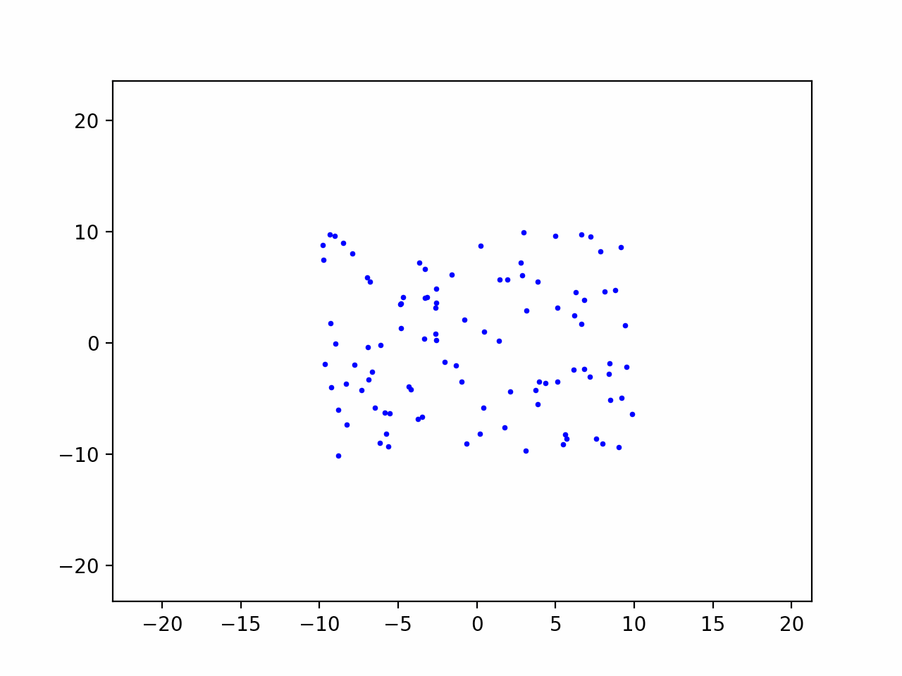
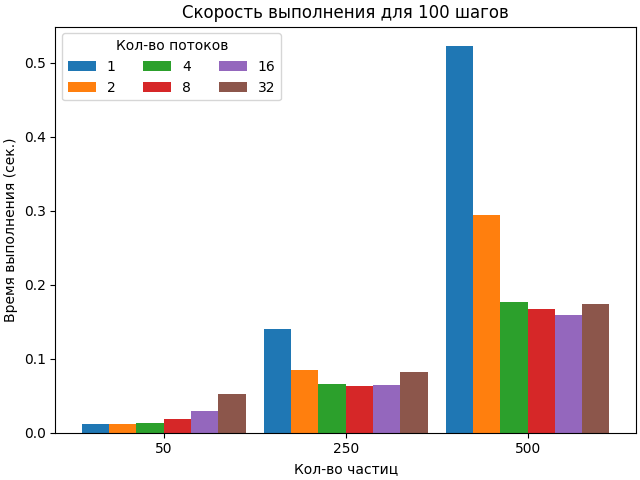
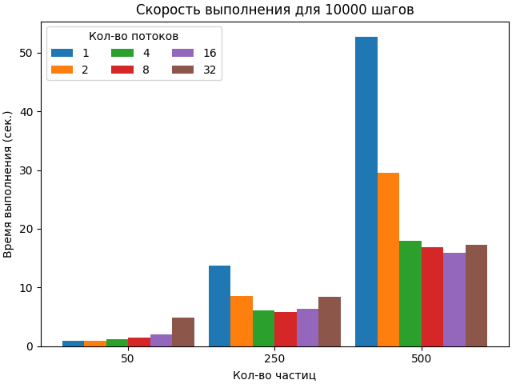

# Lab #1 | N-Body problem | pthread usage

## Dependencies

1. gcc/clang/msbuild
2. cmake
3. python

## Preparation

#### Install python dependencies
```
pip install -r requirements.txt
```

#### Generate input data using python [script](generate_data.py)
```
python generate_data.py <particles_count> <steps> <filename>
```

#### Help for generation
```
python generate_data.py --help

positional arguments:
  particles_count  Number of particles
  steps            Number of steps
  filename         Destination of generation

options:
  -h, --help       show this help message and exit
  -mmin MMIN       Minimum mass for body (default=10000.0)
  -mmax MMAX       Maximum mass for body (default=50000.0)
  -xmin XMIN       Minimum x position for body (default=-10.0)
  -xmax XMAX       Maximum x position for body (default=10.0)
  -ymin YMIN       Minimum y position for body (default=-10.0)
  -ymax YMAX       Maximum y position for body (default=10.0)
  -vxmin VXMIN     Minimum speed projection on x for body (default=-5.0)
  -vxmax VXMAX     Maximum speed projection on x for body (default=5.0)
  -vymin VYMIN     Minimum speed projection on y for body (default=-5.0)
  -vymax VYMAX     Maximum speed projection on y for body (default=5.0)
```


## Build [source](main.c)

```
cmake -B build . && cmake --build build
```

## Usage

```
./build/app <input_filename> <output_filename> <thread_count>
```

## Analyze
#### Generate animation using python [script](visualize_data.py)

```
python visualize_data.py <filename>
```



#### Analyze speed using python [script](analyze_data.py)



