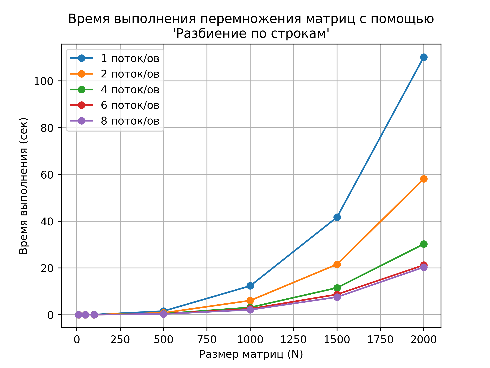
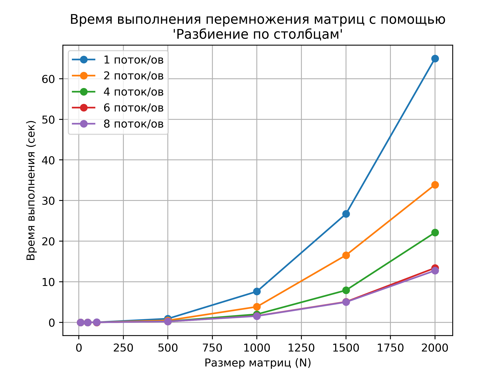
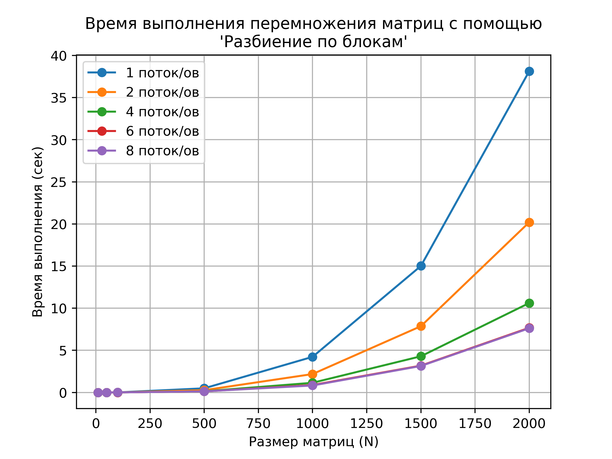

# Перемножение матриц с помощью MPI


## Описание
MPI (Message Passing Interface) - это стандарт для обмена сообщениями между процессами в параллельных вычислениях. Он определяет набор функций для передачи данных между процессами, синхронизации и управления процессами.

OpenMPI - это реализация стандарта MPI, которая предоставляет библиотеку функций для параллельных вычислений на кластерах и суперкомпьютерах. Она поддерживает различные архитектуры процессоров и операционные системы, и может использоваться для разработки высокопроизводительных приложений.

Работа программы проверена с помощью OpenMPI.

Графики построены с помощью matplotlib в скрипте _[analyze.py](analyze.py)_

## Запуск
```
mpic++ src/main.cpp -o app && mpiexec -n <num_processes> ./app <size> <algorithm>

num_threads - ограничено количеством потоков на вашей машине
matrix_size - не ограничено (длина матрицы и по совместительству ширина)
algo_name - название алгоритма (одно из трёх: row, column, block)
```

## Окружение
- CPU: Apple M1, 8 cores
- Compiler: clang 14.0.0

## Алгоритм 1: по строкам
Делим матрицу А на строки и отдаем их потокам с помощью MPI_Scatter. Матрицу B отдаем всем потокам полностью с помощью MPI_Bcast. Поток перемножает, отданные ему, строки на всю матрицу B. Все потоки отсылают данные в главный поток с помощью MPI_Gather.



## Алгоритм 2: по столбцам
Делим матрицу А на столбцы и отдаем их потокам с помощью MPI_Scatter. Матрицу B отдаем всем потокам полностью с помощью MPI_Bcast. Поток перемножает, отданные ему, столбцы на элементы матрицы B, получая часть результирующей матрицы. Все потоки отсылают свои части в главный поток с помощью MPI_Reduce.



## Алгоритм 3: по блокам
Делим матрицу А на блоки и отдаем их потокам с помощью MPI_Scatter. Матрицу B отдаем всем потокам полностью с помощью MPI_Bcast. Поток перемножает, отданные ему, блоки на элементы матрицы B, получая часть результирующей матрицы. Все потоки отсылают свои части в главный поток с помощью MPI_Gather.



## Вывод
В целом, разбиение по блокам оказалось самым эффективным, поскольку этот алгоритм демонстрирует меньшее время выполнения на всех количествах потоков, что говорит о его эффективности в использовании вычислительных ресурсов

Алгоритмы разбиения по строкам и столбцам показывают схожую производительность и подходят для небольшого числа процессов. Но, они могут быть неэффективными для случаев, когда число строк (или столбцов) не делится нацело на число процессов, из-за чего работа распределяется не равномерно, что заставляет другие потоки ждать завершения блокирующих операций (Scatter, Gather, Reduce и тд)

## Послесловие
Изначально пытался создать callback-систему: разделить всю работу, чтобы каждый поток оперировал только с двумя векторами (получал два вектора, перемножал, выдавал результат), а главный поток получал данные от потоков-вычислителей. Но не приуспел, так как уткнулся в thread-lock из за ужасной системы отправки сообщений (остатки этой ситемы можно найти закомменчеными в _[src/mpi.hpp](src/mpi.hpp)_ или в истории коммитов ;)

## Примеры логов

По строкам (Матрица 5x5 | 3 Потока)
```
Matrix A [
 2.00  5.00  4.00  3.00  2.00 
 2.00  1.00  3.00  1.00  3.00 
 1.00  2.00  1.00  1.00  5.00 
 4.00  5.00  1.00  3.00  1.00 
 5.00  2.00  4.00  4.00  5.00 
]
Matrix B [
 2.00  2.00  4.00  2.00  1.00 
 5.00  2.00  2.00  2.00  5.00 
 3.00  5.00  2.00  2.00  4.00 
 1.00  1.00  5.00  1.00  2.00 
 4.00  2.00  1.00  2.00  2.00 
]
Local Result [
36.00 22.00 20.00 19.00 27.00 
43.00 28.00 44.00 25.00 41.00 
]
Local Result [
56.00 48.00 57.00 36.00 49.00 
]
Local Result [
52.00 41.00 43.00 29.00 53.00 
31.00 28.00 24.00 19.00 27.00 
]
Global Result [
52.00 41.00 43.00 29.00 53.00 
31.00 28.00 24.00 19.00 27.00 
36.00 22.00 20.00 19.00 27.00 
43.00 28.00 44.00 25.00 41.00 
56.00 48.00 57.00 36.00 49.00 
]
```

По столбцам (Матрица 5x5 | 3 Потока)
```
Matrix A [
 1.00  2.00  2.00  1.00  4.00 
 4.00  1.00  4.00  2.00  4.00 
 3.00  2.00  5.00  3.00  3.00 
 2.00  2.00  1.00  5.00  3.00 
 1.00  4.00  3.00  1.00  1.00 
]
Matrix B [
 3.00  4.00  4.00  4.00  4.00 
 1.00  1.00  1.00  3.00  1.00 
 2.00  1.00  2.00  4.00  4.00 
 1.00  5.00  3.00  3.00  4.00 
 4.00  1.00  4.00  2.00  2.00 
]
Local Result [
 0.00  0.00 58.00 47.00  0.00 
 0.00  0.00 17.00 22.00  0.00 
 0.00  0.00 34.00 34.00  0.00 
 0.00  0.00 52.00 39.00  0.00 
 0.00  0.00 40.00 30.00  0.00 
]
Local Result [
 0.00  0.00  0.00  0.00 56.00 
 0.00  0.00  0.00  0.00 21.00 
 0.00  0.00  0.00  0.00 34.00 
 0.00  0.00  0.00  0.00 46.00 
 0.00  0.00  0.00  0.00 40.00 
]
Local Result [
43.00 42.00  0.00  0.00  0.00 
15.00 15.00  0.00  0.00  0.00 
24.00 33.00  0.00  0.00  0.00 
40.00 35.00  0.00  0.00  0.00 
26.00 29.00  0.00  0.00  0.00 
]
Global Result [
43.00 42.00 58.00 47.00 56.00 
15.00 15.00 17.00 22.00 21.00 
24.00 33.00 34.00 34.00 34.00 
40.00 35.00 52.00 39.00 46.00 
26.00 29.00 40.00 30.00 40.00 
]
```

По блокам (Матрица 5x5 | 3 Потока)
```
Matrix A [
 1.00  3.00  1.00  5.00  3.00 
 3.00  4.00  2.00  3.00  5.00 
 1.00  5.00  4.00  3.00  5.00 
 5.00  1.00  3.00  2.00  4.00 
 5.00  3.00  3.00  4.00  5.00 
]
Matrix B [
 4.00  2.00  1.00  4.00  3.00 
 2.00  5.00  4.00  1.00  4.00 
 2.00  1.00  1.00  2.00  4.00 
 3.00  4.00  2.00  1.00  1.00 
 3.00  5.00  4.00  5.00  1.00 
]
Local Block [
46.00 68.00 51.00 45.00 47.00 
46.00 46.00 32.00 49.00 37.00 
]
Local Block [
59.00 69.00 48.00 58.00 48.00 
]
Local Block [
36.00 53.00 36.00 29.00 27.00 
48.00 65.00 47.00 48.00 41.00 
]
Global Result [
36.00 53.00 36.00 29.00 27.00 
48.00 65.00 47.00 48.00 41.00 
46.00 68.00 51.00 45.00 47.00 
46.00 46.00 32.00 49.00 37.00 
59.00 69.00 48.00 58.00 48.00 
]
```
