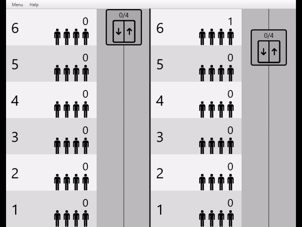

# LiftsFX
Файлы:
- GUI.java - инициализация и запуск окна (Runnable)
    - Controller.java - управление элементами GUI
    - fxml/simple.fxml - элементы GUI
    - fxml/img - изображения, используемые в GUI
- Lift.java - обработчик очередей (Runnable)
- Passenger.java - элемент очереди с симуляции ожиданий (Runnable)

Оригинальный проект без GUI: https://github.com/egortrue/HSE-SE-Works/tree/master/2nd_course/Java/Lifts

Пример работы графического приложения:

